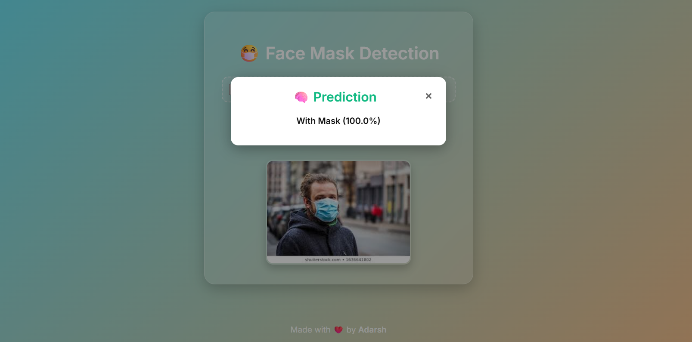

# 😷 Face Mask Detection using Deep Learning

A deep learning-based web application that classifies whether a person is wearing a face mask or not using real-time image upload. Built with **TensorFlow**, **OpenCV**, and deployed using **Flask** on **Azure App Service**.

---

## 📦 Dataset

The dataset is divided into two categories:
- `with_mask/`
- `without_mask/`

Sourced from Kaggle/Real-World Images.

---

## 🧠 Model Architecture

- **Input:** 128x128 resized RGB image
- **Layers:**
  - Conv2D + MaxPooling
  - Dropout
  - Flatten
  - Dense (fully connected)
- **Activation Functions:** ReLU, Softmax
- **Accuracy:** Achieves ~92–95% on test data

---

## 📈 Training Results

- Training & Validation Accuracy and Loss graphs plotted using `matplotlib`
- Model saved as `mask_detector_model.h5`

---

## 🖼️ Frontend Features

- Sleek responsive design with **modern colors**
- Upload image interface
- Pop-up prediction results with label and confidence
- "Made with ❤️ by Adarsh" footer

---

## 🚀 Deployment

### ✔️ Requirements
- Python 3.x
- Flask
- TensorFlow / Keras
- OpenCV
- Gunicorn (for Azure)

### ✔️ Setup
```bash
pip install -r requirements.txt
```

### ✔️ Azure Deployment Steps

1. Create new Web App on Azure
2. Connect GitHub repo in Deployment Center
3. Include the following files in your repo:
   - `requirements.txt`
   - `Procfile` (content: `web: gunicorn app:app`)
4. Push code to GitHub – Azure will auto-deploy

---

## 📁 Project Structure

```
├── app.py
├── static/
│   └── style.css
├── templates/
│   └── index.html
├── mask_detector_model.h5
├── requirements.txt
├── Procfile
├── README.md
└── dataset/
    ├── with_mask/
    └── without_mask/
```

---

## 💻 Demo

Visit: [Your Azure URL here]

---

## 📸 Screenshot



---

## 🙌 Author

**Adarsh Paswan**  
*Made with ❤️ — Happy Coding!*
